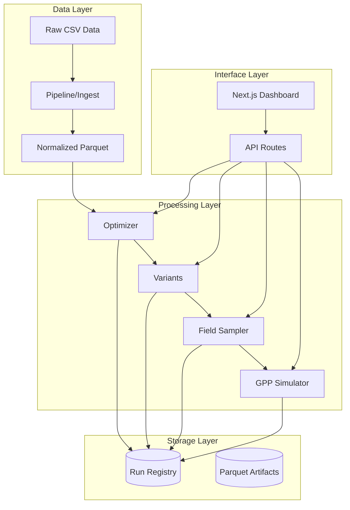

# NBA-DFS Pipeline

A comprehensive data pipeline and optimization system for NBA Daily Fantasy Sports, combining advanced mathematical optimization with an intuitive web interface for lineup generation, variant analysis, field sampling, and tournament simulation.

## Overview

NBA-DFS is a **monorepo** that provides end-to-end DFS workflow management with strict deterministic processing requirements. It combines a robust Python backend for data processing and optimization with a modern Next.js frontend for visualization and interaction.

### Key Features

- **📊 Data Pipeline**: Automated ingestion, normalization, and validation of projection data
- **🔬 Mathematical Optimization**: CP-SAT and CBC solvers for optimal lineup generation
- **🎯 Variant Analysis**: Generate diverse lineup variants from base optimizations
- **👥 Field Sampling**: Create representative contest field compositions
- **🏆 Tournament Simulation**: Monte Carlo simulation with expected value calculations
- **🎨 Web Interface**: Unified dashboard for all pipeline operations
- **🔄 Deterministic Processing**: Reproducible results with explicit seed management
- **📈 Analytics**: Comprehensive metrics and performance tracking

## Architecture



### Core Workflow

1. **📥 Ingest**: Raw CSV projections → Normalized parquet with schema validation
2. **⚡ Optimize**: Projections → Optimal lineups using CP-SAT/CBC solvers  
3. **🔀 Generate Variants**: Base lineups → Diversified lineup variants
4. **👥 Sample Field**: Variants → Representative contest field composition
5. **🎲 Simulate**: Contest field → Tournament results with EV metrics

## Project Structure

```
nba-dfs/
├── pipeline/           # Data ingestion, normalization & schemas
├── processes/          # Core analysis modules (optimizer, variants, etc.)
├── app/               # Next.js web application
├── lib/               # Shared TypeScript utilities
├── components/        # React UI components
├── configs/           # YAML configuration files
├── docs/              # Documentation and design specs
├── tests/             # Comprehensive test suite
├── scripts/           # Development and utility scripts
├── data/              # Parquet data store (gitignored)
└── runs/              # Run artifacts and registry
```

## Quick Start

### Prerequisites

- **Python 3.11+** with `uv` package manager
- **Node.js 18+** with npm
- **Git** for version control

### Installation

```bash
# Clone the repository
git clone <repository-url>
cd nba-dfs

# Install Python dependencies
uv sync --extra dev

# Install Node.js dependencies  
npm install

# Verify installation
uv run python --version
node --version
```

### Development Setup

```bash
# Start the web development server
npm run dev

# The application will be available at http://localhost:3000
```

### Example: Complete DFS Workflow

```bash
# 1. Ingest raw projections data
python -m pipeline.ingest \
  --slate-id 20251101_NBA \
  --source primary \
  --projections data/raw/projections.csv \
  --player-ids data/raw/player_ids.csv \
  --mapping pipeline/ingest/mappings/dk_source.yaml

# 2. Run optimizer to generate base lineups
python -m processes.optimizer \
  --slate-id 20251101_NBA \
  --site DK \
  --config configs/optimizer.yaml \
  --seed 42

# 3. Generate lineup variants
python -m processes.variants \
  --slate-id 20251101_NBA \
  --config configs/variants.yaml \
  --seed 42 \
  --from-run optimizer_run_id

# 4. Sample contest field
python -m processes.field_sampler \
  --slate-id 20251101_NBA \
  --config configs/field.yaml \
  --seed 42 \
  --from-run variants_run_id

# 5. Run GPP simulation
python -m processes.gpp_sim \
  --slate-id 20251101_NBA \
  --config configs/sim.yaml \
  --seed 42 \
  --from-run field_run_id
```

## Module Documentation

### Core Modules

| Module | Purpose | Documentation |
|--------|---------|---------------|
| **[pipeline/](pipeline/README.md)** | Data ingestion, normalization & schemas | [→ Pipeline README](pipeline/README.md) |
| **[processes/](processes/README.md)** | Optimization, variants, field sampling & simulation | [→ Processes README](processes/README.md) |
| **[app/](app/README.md)** | Next.js web application & API routes | [→ App README](app/README.md) |
| **[lib/](lib/README.md)** | Shared TypeScript utilities & state management | [→ Lib README](lib/README.md) |
| **[components/](components/README.md)** | React UI components & design system | [→ Components README](components/README.md) |

### Supporting Directories

| Directory | Purpose | Documentation |
|-----------|---------|---------------|
| **[configs/](configs/README.md)** | YAML configuration files | [→ Configs README](configs/README.md) |
| **[docs/](docs/README.md)** | Design documentation & PRPs | [→ Docs README](docs/README.md) |
| **[tests/](tests/README.md)** | Comprehensive test suite | [→ Tests README](tests/README.md) |
| **[scripts/](scripts/README.md)** | Utility scripts & automation | [→ Scripts README](scripts/README.md) |

## Technology Stack

### Backend (Python)
- **Optimization**: OR-Tools (CP-SAT), PuLP (CBC)
- **Data Processing**: pandas, pyarrow, duckdb
- **Validation**: pydantic, jsonschema
- **API**: FastAPI (future)
- **Testing**: pytest, coverage

### Frontend (Next.js)
- **Framework**: Next.js 14, React 18
- **UI Components**: Shadcn/ui, Radix UI
- **Styling**: Tailwind CSS
- **State Management**: Zustand
- **Data Tables**: TanStack Table
- **Testing**: Vitest, Playwright

### Data Storage
- **Primary**: Parquet files (via pyarrow)
- **Schemas**: JSON Schema Draft 2020-12
- **Registry**: Append-only run tracking
- **Export**: 1:1 CSV/JSON capability

## Development Workflow

### Code Quality Pipeline

```bash
# Python code quality (required before commit)
uv sync --extra dev
ruff check .
black --check .
mypy .
pytest -q

# Frontend development
npm run dev          # Development server
npm run build        # Production build
npm run test         # Unit tests
npm run test:e2e     # End-to-end tests
```

### Environment Configuration

```bash
# .env.example (copy to .env)
NEXT_PUBLIC_API_BASE_URL=http://localhost:3000
PYTHON_ENV_PATH=./.venv/bin/python
DFS_SOLVER_MODE=python  # or 'sampler' for fallback
DATA_ROOT=./data
```

## Key Principles

### Determinism & Reproducibility
- **Seeded Operations**: All stochastic operations require explicit `seed` parameter
- **Immutable Artifacts**: Run artifacts include metadata with seed, config, and timestamps  
- **Content Hashing**: Input files tracked by SHA-256 for change detection
- **Idempotent**: Same inputs + seed = same outputs

### Data Integrity
- **Schema Validation**: All I/O operations validate against strict JSON schemas
- **Player ID Persistence**: `player_id_dk` flows through entire pipeline
- **Lineage Tracking**: Complete audit trail from raw data to final results
- **Protected Areas**: `data/raw/` and `runs/` are read-only for safety

### Code Quality Standards
- **Typing**: Strict TypeScript and Python type checking
- **Testing**: >80% code coverage target
- **Linting**: Automated code formatting and style enforcement
- **Documentation**: Comprehensive READMEs and inline documentation

## Performance Characteristics

### Optimization Performance
- **Small Contests** (≤100 lineups): ~2-10 seconds
- **Large Contests** (1000+ lineups): ~30-120 seconds  
- **Solver**: CP-SAT preferred, CBC fallback available
- **Memory**: ~1-4GB for typical workloads

### Data Processing
- **Ingestion**: ~1-5 seconds for typical CSV files
- **Validation**: Real-time schema validation during upload
- **Storage**: Parquet provides ~10x compression vs CSV
- **Export**: Sub-second DraftKings CSV generation

## Troubleshooting

### Common Issues

**Python Environment**:
```bash
# Reinstall dependencies
uv sync --extra dev

# Check Python version
python --version  # Should be 3.11+
```

**Solver Issues**:
```bash
# Test CP-SAT availability
python -c "from ortools.sat.python import cp_model; print('CP-SAT available')"

# Fallback to CBC
export DFS_SOLVER_MODE=sampler
```

**Frontend Issues**:
```bash
# Clear Next.js cache
rm -rf .next

# Reinstall dependencies
rm -rf node_modules package-lock.json
npm install
```

### Getting Help

1. **Check Documentation**: Module-specific README files
2. **Review Issues**: Check existing GitHub issues
3. **Run Tests**: `pytest -xvs` for detailed error output
4. **Check Logs**: Process logs in `runs/{run_id}/manifest.json`

## Contributing

### Development Guidelines

1. **Small Changes** (<30 LOC): Direct implementation allowed
2. **Large Changes** (>30 LOC): Create PRP document first
3. **Schema Changes**: Always require tests and documentation
4. **Code Style**: Follow existing patterns and conventions

### Pull Request Process

1. Create feature branch from `main`
2. Implement changes with tests
3. Run full CI pipeline locally
4. Submit PR with clear description
5. Address review feedback
6. Merge after approval

### Code Style

```bash
# Python formatting
black .
ruff check . --fix

# TypeScript/React formatting  
npm run lint
npm run type-check
```

## Deployment

### Production Build

```bash
# Build frontend
npm run build

# Prepare Python environment
uv sync --no-dev

# Set production environment
export NODE_ENV=production
export DFS_SOLVER_MODE=python
```

### Environment Variables

**Required**:
- `NODE_ENV` - Environment (development/production)
- `DATA_ROOT` - Data storage directory path

**Optional**:
- `DFS_SOLVER_MODE` - Solver preference (python/sampler)
- `NEXT_PUBLIC_API_BASE_URL` - API base URL for frontend

## Roadmap

### Near Term (Q1 2025)
- [ ] Enhanced web interface with real-time updates
- [ ] Advanced stacking and correlation models
- [ ] Multi-site support (FanDuel, SuperDraft)
- [ ] Performance optimizations and caching

### Medium Term (Q2-Q3 2025)  
- [ ] Machine learning projection enhancements
- [ ] Real-time contest monitoring
- [ ] Advanced analytics and reporting
- [ ] Mobile-responsive interface improvements

### Long Term (Q4 2025+)
- [ ] Multi-sport support (NFL, MLB, etc.)
- [ ] Collaborative lineup building
- [ ] Integration with external data sources
- [ ] Advanced risk management tools

## License

This project is proprietary software. All rights reserved.

## Support

For technical support, feature requests, or bug reports:

1. **Documentation**: Check module-specific README files
2. **Issues**: Create GitHub issue with detailed description
3. **Development**: Follow contribution guidelines above

---

**Last Updated**: 2025-09-08  
**Version**: 0.1.0  
**Maintainer**: NBA-DFS Development Team