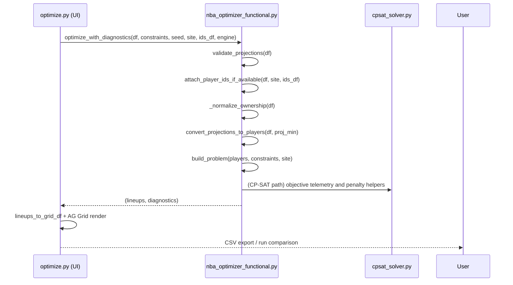

# Legacy Optimizer Overview and De‑UI Plan (PRP‑2L)

## Overview
The legacy optimizer combines a Streamlit UI (`optimize.py`) with a functional solver core (`nba_optimizer_functional.py`). The UI hosts controls, visualization (AG Grid), and exports. The core implements projection validation, DK ID attachment, ownership penalty models, pruning, and solver orchestration (CBC/CP‑SAT).

## Module Graph
```mermaid
graph TD
  UI[optimize.py (Streamlit UI)] -->|calls| Core[nba_optimizer_functional.py]
  Core -->|uses| CPSAT[cpsat_solver.py]
  Core -->|uses| PRUNE[pruning.py]
  UI -->|AG Grid| AGG[st_aggrid]
  UI -->|path hack| BACKEND[backend.* (external)]
  UI -->|I/O| IOF[io_facade.run_io (external)]
  UI -->|components| FE[frontend.components.* (external)]
```

External modules (`backend.*`, `io_facade.*`, `frontend.*`) are legacy paths referenced via `sys.path.append`; they are not needed for a headless adapter.

## Call Flow


## I/O Shapes
- Inputs (projections_df):
  - Required: `name` (str), `team` (str A‑Z 2–4), `position` ("PG" or "PG/SG"), `salary` (int), `proj_fp` (float)
  - Optional: `own_proj` (float [0,1] or %), `stddev` (float), `minutes` (float), `dk_id` (str|int)
- Outputs:
  - `lineups`: List[Lineup] each with players: `player_id`, `name`, `team`, `positions`, `salary`, `proj`, `own_proj?`, `dk_id?`
  - `diagnostics`: `{success_rate, warnings[], errors[], normalization.ownership{...}, ownership_penalty{...}, engine, ...}`
  - CSV helpers: DK import CSV (header `PG,SG,SF,PF,C,G,F,UTIL`).

## De‑UI Extraction Plan
- Headless API to expose in PRP‑2:
  - `run_optimizer(projections_df, constraints: dict, seed: int, site: str, engine: str) -> (lineups_df, metrics_dict)`
  - Implementation sketch: call `optimize_with_diagnostics` then convert to a tabular `lineups_df` using `lineups_to_grid_df`; pass `diagnostics` through as `metrics_dict`.
- UI dependencies to isolate/remove:
  - Streamlit (`st.*`), AG Grid CSS, `st_aggrid` components
  - `st.session_state` coupling and spinners
  - Download/retention buttons and direct file I/O
  - `sys.path.append` and `backend.*` imports → replace with proper package paths
  - `io_facade.*`, `frontend.*` used by the UI only
- Minimal refactors in PRP‑2:
  - Lift compute helpers into a package path accessible without path hacks
  - Keep `nba_optimizer_functional` stable; adapter composes solved lineups + diagnostics

## Risks & Notes
- Hidden imports from external legacy packages need stubbing or removal in PRP‑2
- Ownership penalty math duplicated in CBC/CP‑SAT helpers; adapter should treat it as opaque diagnostics
- DK‑strict flows depend on `dk_data/` file layout; adapter should inject validated inputs instead

